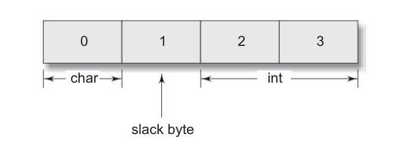

# Operation on individuals members

```
Computer stores structures using the comcept of "word boundary". The size of a word boundary is machine independent. In a computer with two bytes word boundary, the members of a structure are stored left_aligned on the work boundary. A character data take one byte and an integer takes two bytes. On byte between them in left unoccupied. This unoccupied byte is known as the *slack byte*.
```



```
When we declare structure variables, each one of them may contain stack bytes and the values stored in such slack bytes are undefined. Due to this, even if the members of two variables are equal, their structure do not necessarily compare equal. C, therefore, does not permit comparison of structures. However, we can design our own function that could compare individual members to decide whether the structures are equal or not.
```

----------

The individual members are identified using the member operator, the *dot*. A member with the *dot operator* along with its structure variable can be treacted like any other variable name and therefore can be implemented using expressions and operators.


```c

    if (student1.number == 111) {
        student1.marks += 10.00;
    }
    float sum = student1.marks + student2.marks;
    student1.marks *= 0.5;


```

### Three ways to access Members


```c
typedef struct {
    int x;
    int y;
} VECTOR;

int vector_function() {
    VECTOR v, *ptr;
    ptr = &v;
}
```

The identifire **ptr** is known as **pointer** that has been assigned the address of the structure variable n. Now, the members can be accessed in three ways.

- using dot notation            : v.x
- using indirection notation    : (*ptr).x
- using selection notation      : ptr->x