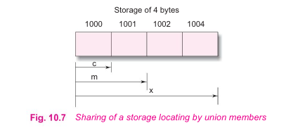

# Unions

Unions follow the same syntax as structures. Howevery, there is major distinction between them in terms of storage. In structures, each member has its own storage location, whereas all the members of union use the same location. This implies that, although a unoion may contain many members of different types, it can handle only one menber at a time. 

A union can be declared using the keyword union as follows:

```c

union item 
{
    int m;
    float x;
    char c;
    code;
};

```

This declares a variable **code** of type **union item**. The union contains three  members, each with a different data type. However we can use only one at a time. This is due to fact that only one location is allocated for a union variable, irrespective of its size.



The compiler allocates a piece of storage that is large enough to hold the largest variable type in the union. 

To access a union member, we can use the same syntax that we use for structure members. That is:

```c
code.m;
code.x;
code.c;
```

are all valid members varaibles.

During accessing, we should make surethat we are accessing the members whose value is currectly stored. For example, the statements such as:

```c
    code.m = 379;
    code.x = 7859.36;

    printf("%d\n", code.m);
    printf("%f\n", code.x);

    code.m = 19;
    printf("%d\n", code.m);

```

```output
1173723873
7859.359863
19
```

would produce erroneous output (which is machine dependent).


----------

In effect, a union creates a storage location that can be used by any one of its members at a time. When a different member is assigned a new value, the new value supersedes the previous member's value.

Union may be used in all place where a structure is allowed. The notation for accessing a union member which is nested inside a structure remains the same as for the nested structures.

Unions may be intialized when the variable is declared. But unlike structures, it can be initialized only with a value of same type as the first union member.

```c
union item abc = {100};
```
