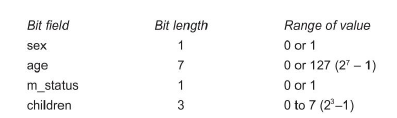
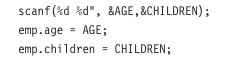
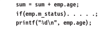
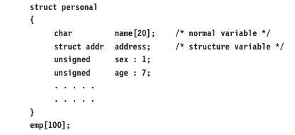

# Bit Fields

Bit fields allow direct manipulation of string of a string of preselected bits as it is represented an integral quantity.

A *bit field* is a set of adjacent bit whose size can be from 1 to 16 bits in length. A word can therefore be divided into a number of bits fields. The name and size of bit fields are defined using a structure.

The general form of bit field defintion is:

```c
struct tag-name 
{
    data-type name1: bit-length;
    data-type name2: bit-length;
    ......
    .....
    data-type nameN: bit-length;
}
```

The data-type is either **int** or **unsigned int** or **signed int** and the *bit-length* is the number of bits used for the specified name. Remember that a **signed** bit field should have at least 2 bits (one bit for sign). The *bit-length* is decided by the range of value to be stored. The largest value that can be stored is 2<sup>n-1</sup>, where **n** is bit-length

The internal representation of bits fields is machine depenedent. That is, it depends on the size of **int** and the ordering of bits. Some machines store bits from left to right others from right to left.

There are several specific points to observe:

1. The first field always starts with the first bit of the word.
2. A bit field cannot overlap integer boundaries. That is, the sum of lengths of all the fields in a structure should not be more than the size of a word. In case, it is more, the overlapping field is automatically force to the beginning of the next word.
3. There can be unnamed fields declared with size. Example:

    - **Unsigned** : *bit-length*

    - Such fields provide padding within the word.

4. There an be unused bits in a word.
5. We cannot take the address of a bit field variable. This means we cannot use **scanf** to read values into bit fields. We can neither use pointer to access the bit fields.
6. Bit fields cannot be arrayed.
7. Bit fiels should be assigned values that are within the rage of their size. It we try to assign values, behaviour would be unpredicted.

----------

Suppose we want to store and use personal information of employees in compressed form, this can be done as follows:

```c
struct personal
{
    unsigned sex : 1;
    unsigned age: 7;
    unsigned m_status: 1;
    unsigned children: 3;
    unsigned : 4;
} emp;

```

This defines a variable name **emp** with four bit fields. The range of values each field could have it follows:



Once bit field are defined, they can be reference just as any other structure-type data item would be referenced. The following assignment statements are valid.

```c
emp.sex = 1;
emp.age = 50;
```

Remember, we cannot use **scanf** to read values into a bit field. We may have to read into  a temporary variable and then assign its value to the bit field. For example:



One restriction is accessing bit fields is that a pointer cannot be used. However, they can used in normal expression like any other variable. For example:



are valid statements.

It is possible to combine normal structure elements with bit field elements. For example:



This declare **emp** as a 100 element array of type **structure personal**. This combines normal variable name and structure type variable **address** with bit fields.

Bit fields are packed intowords as they appear in the definition. Consider the following definition:

```c
struct pack 
{
    unsigned a:2;
    int count;
    unsigned b:3;
};
```

Here, the bit field **a** will be in one word, the variable counter will be in the second word and bit field **b** will be in the in third word. The fields `a` and `b` would not get packed into the same word.