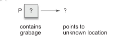
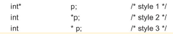

# Declaring pointer Variables

Pointer variables contain addresses that belong to a separate data type, they must be declared as pointers before we use them. The declaration of a pointer variales takes the following form:


This tells the compiler three things about the variable **pt_name**.

1. The asterisk (*) tells that the variable **pt_name** is a pointer variable.
2. **pt_name** needs a memory location.
3. **pt_name** points to a variable of type *data_type*.

For example,

```c
int *p      /* integer pointer */
```

declares the variable **p** as a pontier variable that points to an integer data type. Remember that the type **int** referes to the datt atype of the variable being pointed to by **p** and no the type of the value of the pointer. Similarly

```c
float *x        /* float pointer */
```

declares **x** as pointer to a floating-point variable.

The declarations cause the compiler to allocate memory locations for the pointer variables **p** and **x**. Since the memory locations have not been assigned any values, these locations may contain some unkonwn values in them and therefore they point to unknown locations as shown:

```c
int *p'
```



### Pointer Declaration Styles

Pointer variables are declared similarly as normal varaibles except for the addition of the unary * operator. This symbol can appear anywhere between the type name nad the printer variable name. Programmers use the following styles:



However, the style 2 is becoming increasingly popular due to the following reasons:

1. This style is convenient to have multiple declarations in the same statement. Example: 

```c
int *p, x, *q;
```


2. This style matches with the format used for accessing  the target values. Example: 

```c
int x, *p, y;
x = 10;
p = &x;
y = *p;     /* accessing x through p */
*p = 20;    /* assigning 20 to x */
```