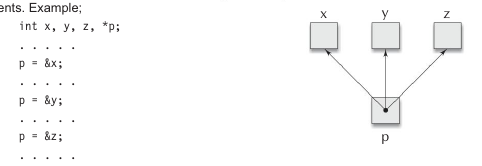

# Initialization of Pointer Variables

The process of assigning the address of a variable to a pointer variable is known as *initialization*.

Example:

```c
int quantityl;
int *p;             /* declaration */
p = &quantity;      /* initialization */
```

We can also combine the initialization and declaration. This is:

```c
int *p = &quantity;
```

It is also possible to combine the declaration of data variable, the declaration of pointer variable and the initialization of the pointer variable in one step. For example,

```c
int x, *p = &x;         /* three in one */
```

We could also define a pointer variable with an initial value of `NULL` or `0` (zero). That is, the following statements are valued:

```c
int *p = NULL;
int *p = 0;
```

### Pointer Flexibility

Pointers are flexible. We can make the same pointer to point to different data variables in different statements. Example:



We can also use different pointers to point to the same data variable. Example:


----------

With the exception of NULL and 0, no other constant value can be assigned to a pointer variable.