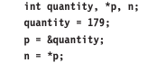
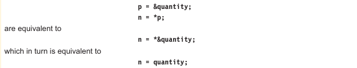

# Accessing a variable through its pointer

To access the value of the variable, is done by using another unary operation * (asterisk), usually known as the *indirection operator*. Another name for the indirection operator is the *dereferencing operator*. Consider the following statements:

The first line declares **quantity** and **n** as integer variables and **p** as a pointer variable pointing to an integer.

The second line assigns the value of 179 to **quantity**. 

The third line assigns the address of **quantity** to the pointer variable **p**. 

The fourth line contains the indirection operator * . When the operator * is place before a pointer variable in an expression (on the right-hand-side of the equal sign), the pointer returns  the value of the variable of which the pointer value is the address. In case the ***p** returns the value of the variable **quantity**, because **p** is  the address of quantity. The * can be rememberd as 'value at addresses'. Thus the value of **n** would be 179. The two statements:

