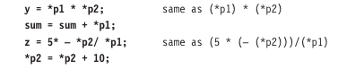
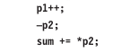

# Pointer Expressions

Like other variables, pointer variables can be sued in expressions. For example, it **p1** and **p2** are properly declared and initialized pointers, then the following statements are valid:

C allows us to add integers to or subtract integers from pointers, as well as to subtract one pointer from aother. p1+4, p2-2, and p1-p2 are all allowed. It p1 and p2 are both pointers to the same array then **p2-p1** gives the number of elements betweeen **p1** and **p2**.

We may also use short-hand operators with the pointers:

In addition to arithmetic operations discussed above, pointers can also be compared using the relational operators. The expression such as **p1 > p2, p1 == p2** and **p1 != p2** are allowed. Howevery any comparison of pointers that refer to separate and unrelated variables make no sense. Comparison can be used meaninfully in handling arrays and strings.

We may not use pointers in division or multiplication. Similarly two pointers cannot be added.