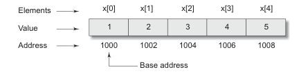
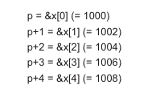
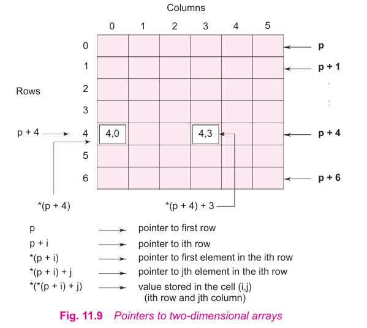
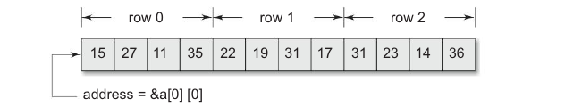

# Pointers and Arrays

When an array is declared, the compiler allocates a base address and sufficient amount of storage to contain all the elements of the array in contiguous memory locations. The base address is the location of the first element (index 0) of the array. The compiler also defines the array name as a constant pointer to the first element. Suppose we declare an array **x** as follow:

```c
int x[5] = {1, 2, 3, 4, 5};
```

Suppose the base address of x is 1000 and assuming that each integer requires two bytes, the five elements will be stored as follows:



The name **x** is defined as a constant pointer pointing to the first element, **x[0]** and therefore to the value of **x** is 100, the location where **x[0]** is stored. That is:

```c
x = &x[0] = 1000;
```

IF we declare **p** as an integer pointer, then we can make the pointer **p** to point to the array **x** by the following assignment:

```c
p = x;
```

This is equivalent to:

```c
p = &x[0];
```

Now, we can access every value of **x** using p++ to move from one element to another. The relationship between **p** and **x** is shown as:



You may notice that the address of an element is calculated using it index and the scale factor of the data type. For instance,

address of x[3] = base address + (3 x scale factor of **int**)
                
= 100 + (3 x 2) = 1006

When handling arrays, instead of using array indexing, we can use pointers to access array elements. Not that ***(p+3)** gives the value of **x[3]**. The pointer accessing method is much faster than array indexing.

Pointers can be used to manipulate two-dimensional array can be represented by the pointer expression as follows:

```
*(x+i) or *(p+i)
```

represents the element **x[i]**. Similarly, an element in a two-dimensional array can be represented by the pointer expression as follows:

```
*(*(a+i)+j) or *(*(p+i)j)
```



As above figure illustrate, how this expression represents the element a[i][j]. The base address of the array **a** is &a[0][0] and starting at this address, the compiler allocateds configuous space for all the elements *row-wise*. That is, the first element of the second row is placed immediately after the last element of the first row, and so on. Suppose we declare an array **a** as follows:

```c
int a[3][4] = {
    {15, 27, 11, 35},
    {22, 19, 31, 17},
    {31, 23, 14, 36}
};
```

The elements of a will be stored as:



If we declare **p** as in **int** pointer with the initial address of &a[0][0], then a[i][j] is equivalent to *(p+4 x i+j).

You may notice that, if we increment **i** by 1, the **p** is incremented by 4, the size of each row. Then the element **a[2][3]** is given by ***(p+2 x 4+3) = *(p+11)**.

This is the reason why, when two-dimenional array is declared, we must specify the size of each row so that the compiler can determine the correct storage mapping.