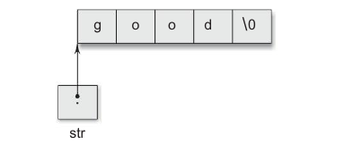
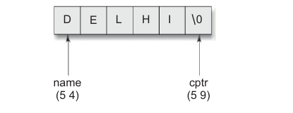
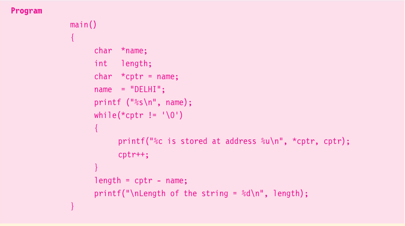
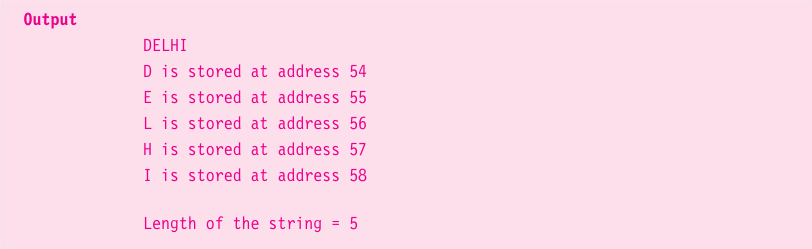

# Pointers and Character Strings

Strings are treated like character arrays and therefore, the are declared and initialized as follows:

```c
char str[4] = "good";
```

The compiler automatically inserts the null character '\0' at the end of the string. C supports an alternative method to create strings using pointer variables of the type **char**. Example:

```c
char *str = "good";
```

This creates a string for literal and then stores its address in the pointer variable **str**.

The pointer **str** now pointers to the first characters of the string "good" as:



We can also use the run-time assignment for giving values to a string pointer. Example 

```c
char * string1;
string1 = "good";
```

We can print the content of the string **string1** using either **printf** or **puts** functions as follows:

```c
printf("%s", string1);
puts(string1);
```

Remember, although **string1** is a pointer to the string, it is also the name of the string. Therefore, we do not need to use indrection operator * here.

Like in one-dimensional arrays, we can use a pointer to access the individual characters in a string.


### Write a program using pointers to determine the length of a character string.

A program to count the length of a string. The statement

```c
char *cptr = name;
```

declares cptr as a poitner to a character ans assigns the address ofthe first character of **name** as the initial value. Since a string is always terminated by the null character, the statement

```c
while(*cptr != '\n')
```

is true until the end of the string is reached.

When the **while** loop is terminated, the pointer **cptr** holds the address of null character. Therefore the statement

```
length = cptr - name;
```

gives the length of the string **name**.




The output also shows the address location of each character. Note that each character occupies one memory cell (byte).





In C, a constant character string always represents a pointer to that string. And therefore the following statements are valid:

```c
chat = *name;
name = "Dehli";
```

These statements will declare **name** as a pointer to character and assign to **name** the constant character string "Dehli". You might remember that this type of assignment does not apply to character arrays. The statements like

```c
char name[20];
name = "Dehli";
```

do not work.