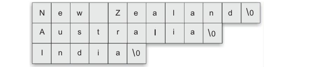

# Array of Pointers 

One important use of pointers is in handling of a table of strings. Consider the following arary of strings:

```c
char name[3][25];
```

This says that the **name** is a table containing three names, each with a maximum length of 25 characters (includuing null character). The total storage requirements for the **name** talbe are 75 bytes.

We known that rarely the individual strings will be of equal lengths. Therefore, instead of making each row a fixed number of characters, we can make it a pointer to a string of varying length. For example,

```c
char *name[3] = {
    "New Zeland",
    "Australia",
    "India"
};
```

declares **name** to be an array of *three pointers* to characters, each pointer pointing to a particular name as:


This declaration allocates only 28 bytes, sufficient to hold all the characters as shown:



The following statement would print out all the three names:

```c
for (i=0; i<=2; i++) {
    printf("%s\n", name[i]);
}
```

To access the jth character in the ith name, we may write as:

```c
*(name[i]+j);
```

The character arrays with the rows of varying length are called 'ragged arrays' and are better handled by pointers.

Remember the difference between the notations *p[3] and (*p)[3]. Since * has a lower precedence than [], *p[3] declares p as an array  of 3 pointers while ( *p[3]) declares p as a pointer to an array of three elements.