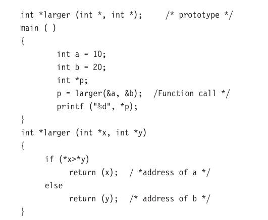

# Pointers as function arguments

We known that when an array is passed to a function as an argument, only the address of the first element of the array is passed, but not the actual values of the array elements. If **x** is an array when  we call **sort(x)**, the address of **x[0]** is passed to the function **sort**. The function uses this address for manupulating the array elements. Similarly, we can pass the address of a variable as an argument to a function in the normal fashion. We use this method when discussing functions that returns mulitple values.

When  we pass addresses to a fashion, the parameters receiving the addresses should be pointers. The process of calling function using pointer to pass the addresses of value is known as 'call by reference'. (The process of passing the actual value of variables is known as 'call by value'). The function which is called by 'reference' can change the value of the variable used in the call.

```c
#include <stdio.h>
#include <stdlib.h>

void change (int *p);

int main() {
    int x;
    x = 20;
    change(&x);     /* call by reference or address */
    printf("%d\n", x);
    return 0;
}

void change(int *p) 
{
    *p = *p + 10;
}
```

When the function **change()** is called, the address of the varible **x**, not its value, is passed into the function **change()**, the variable **p** is declared as a pointer and therefore **p** is the address of the variable **x**. The statement,

```c
*p = *p + 10;
```

means 'add 10 to the value stored at the address **p'**. Since **p** represents the address of **x**, the value of **x** is changed from 20 to 30. Therefore, the output of the program will be 30, not 20.

Thus, call by reference provides a mechanism by which the function can change the stored values in the calling function. Note that this mechanism is also konwn as *"call by address"* or *"pass by pointers"*.


### Functions returning pointers

We have seen so far that a function can return a single value by its name or return mulitple values through pointer parameters. Since pointers are a data type in C, we can also force a function to return a pointer to the calling function. Consider the following code:



The function **larger** recevies the addresses of the variables **a** and **b**, decides which one is larger using the pointers **x** and **y** and then returns the address of its location. The returned value is then assigned to the pointer variable **p** in the calling function. In this case, the address of **b** is returned and assigned to **p** and therefore the output will be value of **b**, namely, 20.

Note that the address returned must be the address of a variable in the calling function. It is error to return the pointer to a local variable in the called function.

### Pointers to Functions

A function, like a variable, has a type and an address location in the memory. It is therefore, possible to declare a pointer to a function, which can then used as an argument in another function. A pointer to a function is declared as follows:

```
type (*ftpr) ();
```

This tells the compiler that **fptr** is a pointer to a function, which returns *type* value. The parentheses around <strong>*fptr</strong> are necessary. Remember that a statement like

```
type *gptr();
```

would declare **gptr** as a function returning a pointer to *type*.

We can make a function pointer to point to a specific function by simply assigning the name of the function to the pointer. For example, the statements:

```c
double mul(int, int):
double (*p1)();
p1 = mul;
```

declare **p1** as a pointer to  a function and **mul** as a function and then make **p1** to point to the function **mul**, we may use the pointer **p1** with the lisst of parameters. That is (*p1)(x,y).

is equivalent to 

```
mul(x, y)
```

Note the parentheses around *p1.


#### Write a programm that uses a function pointer as a function argument.

A program to print the function values over give range of values. The printing is done by the function **table** by evaluating the function passed to it by the **main**.

With **table**, we declare the parameter **f** as a pointer to a function as follows:

```c
double (*f)();
```

The value returned by the function is to type **double**. When **table** is called in the statement:

```c
table(y, 0.0, 2, 0.5);
```

we pass a pointer to the function **y** as the first parameter of **table**. Note that **y** is not followed by a parameter list.

During the execution of **table**, the statement:

```
value = (*f)(a);
```

calls the function **y** which is pointed to by **f**, passing it the parameter **a**. Thus the function **y** is evaluated over the range 0.0 to 2.0 at the intervals of 0.5.

Similarly, the call 

```
table(cos, 0.0, PI, 0.5);
```

passes a pointer to **cos** as its first parameter and therefore, the function **table** evaluates the value of **cos** over the range 0.0 to PI at the intervalus of 0.5.


### Compatibility and Casting

A variable declared as a pointer is not just a *pointer* type variable. It is also a pointer to a specific fundamental data type, such as a character. A pointer therefore always has a type associated with it. We cannot assign a pointer of one type to a pointer of another type, although both of them have memory addresses as their values. This is known as *incompatibility* of pointers.

All the pionter variables store memory addresses, which  are compatible, but what is not compatible is the underlying data type to which they point to. We cannot use the assignemtn operator with the pointers of different types. We can however make explicit assignement between incompatible pointer types by using **cast** operator, as we do with the fundamental types. Example:

```c
int x;
char *p;
p = (char *) & x;
```

In such cases, we must ensure that all operators that use the pointer **p** must apply casting properly.

We have an exception. The exception is the void pointer (void *). The void pointer is a **generic pointer** that can represent any pointer type. All pointer types can be assigned to a void pointer and a void pointer can be assigned to any pointer without casting. A void pointer is created as follows:

```c
void *np;
```

Remember that since a void pointer has no object type, it cannot be de-referenced.