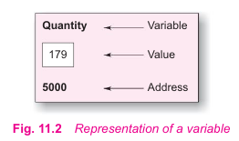
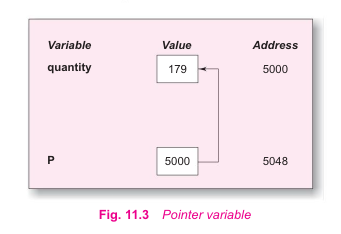
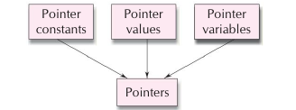

# Pointers

A pointer is a derived data type in C. It is built from one of the fundamental data types available in C. Pointers contain memory addresses as their values. Since these memory addresses are the locations in the computer memory where program instructions and data are stored, pointers can be used to access and manipulate data stored in the memory.

### Understanding pointers

The computer's memory is a sequential collection of *storage cells*. Each cell commonly known as a byte, has a number called *address* associated with it. Typically the address are numbered consecutively starting from zero. The last address depends on the memory on the memory size. A computer system having 64K memory will have its last address as 65,535.

Whenevee we declare a variable, the system allocates, somewhere in the memory, an appropriate location to hold the value of the variable. Since every byte has a unique address number, t his location will have its own address number.

Consider the following statement:

```c
int qunatity = 179;
```

This statement instructs the system to find a location for the integer variable **quantity** and puts the value 179 in that location. Let us assume that the system has chosen the address location 5000 for **quantity**.



During the execution of the program, the system always associates the name **quantity** with the address 5000. We may have access to the value 179 by using either the name **quantity** or the address 5000. Since memory addresses are simple numbers, they can be assigned to some variables, that can be stored in memory, like any other variables. Such variables that hold memory addresses are called *pointer variables*. A pointer variable is, therefore, nothing but a variable that contains an address, which is a location of another variable in memory.

Remember, since a pointer is a variable, its value is also stored in another location. Suppose, we assign the address of **quantity** to a variable **p**. The link between the variables **p** and **quantity** is:



Since the value of the variable **p** is the address of the variable **quantity**, we may access the value of **quantity** by using the value of **p** and therefore, we say that the variable **p** 'points' to the variable **quantity**. Thus **p** gets the name 'pointer'.


### Underlying Concepts of Pointers

Pointers are built on the three underlying concepts as illustrated bellow:



Memory addresses within a computer are referred to as *pointer constants*. We cannot change them; we can only use them to store data values.

We cannot save the value of a memory address directly. We can only obtain the value through the variable stored there using the address operator (&). The value thus obtained is known as *pointer value*. The pointer value (i.e. the address of a variable) may change from on run of the program to another.

Once we have a pointer value, it can stored into another variable. The variable that contains a pointer value is called *pointer variable*.