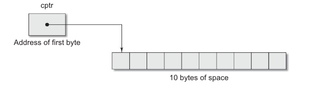

# Allocating a Block of Memory: malloc

A block of memory may be allocated using the function **malloc**. The **malloc** function reserves a block of memory of specified size and returns a pointer of type **void**. This means that we can assign it to any type of pointer. It takes the following form:

```c
ptr = (cast-type *) malloc(byte-size);
```

**ptr** is a pointer of type *case-type*. The **malloc** returns a pointer (of *cast-type*) to an area of memory with size *byte-size*.

```c
x = (int *) malloc (100 * sizeof(int));
```

One successfully execution of this statement, a memory space equivalent to "100 times the size of an int" bytes is reserved and the address of the first-byte of the memory allocated is assigned to the pointer **x** of the typ of **int**.

Similar, the statement

```c
cptr = (char *) mallock(10);
```

allocates 10 bytes of space for the pointer **cptr** of type **char**. This is illustrated as:



Note that the storage space allocated dynamically has no name and therefore its contents can be accessed only through a pointer.

We also use **malloc** to allocated space for complex data types such as structures. Example:

```c
st_var = (struct store *) malloc (sizeof(struct store));
```

where, **st_var** is a pontier of type **struct store**.

**Remember, the **malloc** allocates a block of contigious bytes. The allocation can fail if the space in the heap is not sufficient to satisfy the request. It it fails, it returns a NULL. We should therefore check whether the allocation is successfull before using the memory pointer.**

[<<< HOME](README.md) ... [calloc >>>](102-allocaing-multiple-block-of-memory-calloc.md)