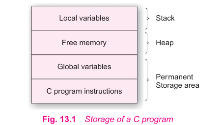

# Dynamic Memory Allocation and Linked Lists

## Dynamic Memory Allocations

The process of allocating memory at run time is known as *dynamic memory allocation*. The following functions help us build complex application programs that use the available memory intelligently.

- **malloc**: Allocates request size of bytes and returns a pointer to the first byte of the allocated space.
- **calloc**: Allocates space for an array of elements, initializes them to zero and then returns a pointer to the memory.
- **free**: Frees previously allocated space.
- **realloc**: Modifies the size of previously allocated space.

### Memory allocation Process

Let us look at the memory allocation process associated with a C program.

- The program instructions and global and static variables are stored in a region known as *permanent storage area* and the local variables are stored in another stack called *stack*. 
- The memory space that is located between these two regions is available for dynamic allocation during execution of the program. This free memory region is called the *heap*. 
- The size of the heap keeps changing when program is executed due to creation and death of variables that are local to functions and blocks. Therefore, it is possible to encounter memory *overflow* during dynamic allocation process. 
- In such as situations, the memory allocation functions mentioned above return a NULL pointer (when they fail to located enough memory requested).

[Allocating memory >>>](101-allocating-memory-malloc.md)