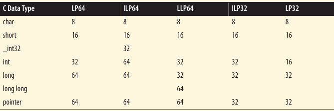

# Pointer Size and Types

Pointer size is an issue when we become concerned about application compatibility and portability.

The size of a pointer depends on the machine is use and the compiler.

### Memory Models

With different machines and compilers come different options for allocating space to C primitive data types. A common notation used to describe different data models is summarized below:

```
I In L Ln LL LLn P Pn
```

Each capital letter corresponds to an integer, long, or pointer. The lowercase letters represent the number of bits allocated for the data type.

Machine memory models:



The model depends on the operating system and compiler.

[Predefined Pointer-Related Types >>>](101-predefined-pointer-related-types.md)