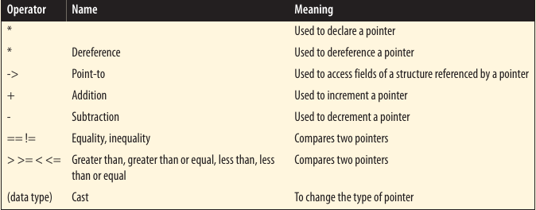
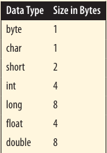

# Pointer Operators



## Pointer Arithmetic

Several arithmetic operations are performed on pointers to data. These included:

- Adding an integer to a pointer
- Subtracting an integer from a pointer
- Subtracting two pointers from each other
- Comparing pointers

These operations are not always permitted on pointers to functions.

### Adding an integer to a pointer

When we add an integer to a pointer, the amount added is the product of the integer times the number of bytes of the underlying data type.



----------

To illustrate the effects of adding an integer to a pointer, we will use an array of integers. Each time one is added to **pi**, four is added to the address. Pointers are declared with data types so that these sorts of arithmetic operations are possible. Knowledge of the data type size allows the automatic adjustment of the possible values in a portable fashion:


```c
#include <stdio.h>

int main() {
    int vector[] = {28, 41, 7};
    int *pi = vector;

    printf("Address: %d\tValue: %d\n", pi, *pi);;
    pi += 1;
    printf("Address: %d\tValue: %d\n", pi, *pi);
    pi+=1;
    printf("Address: %d\tValue: %d\n", pi, *pi);
    return 0;
}
```

```
28
41
7
```

----------

When an array name is used by itself, it returns the address of an array, which is also the address of the first element of the array.

----------


Examples showing value of pointer point to along with the address. 

```c
#include <stdio.h>

int main() {
    int vector[] = {28, 41, 7};
    int *pi = vector;


    printf("Address: %u\tValue: %d\n", pi, *pi);;
    pi += 1;
    printf("Address: %u\tValue: %d\n", pi, *pi);
    pi+=1;
    printf("Address: %u\tValue: %d\n", pi, *pi);
    return 0;
}
```

```
Address: 854949692      Value: 28
Address: 854949696      Value: 41
Address: 854949700      Value: 7
```

----------

In the following sequence we address three to the pointer. The variable **pi** will contain the address 112, the address of **pi**.

```c
pi = vector;
pi += 3;
```

----------


Accessing memory pass the end of the an array is a dangerous thing to do and should be avoided. There is no guarantee that the memory access will be a valid variable.

----------


The following declarations will be used to illustrate the addition operation performed with a short and then a **char** data type:

```c
short s;
short *ps = &s;
char c;
char *pc = &c;
```

Let's assume memory is allocated. The addresses used here are all on a four-byte boundary. Real addresses may be aligned on different boundaries and in a different order.

The following sequence adds on to each pointer and then displays their contents:

```c
#include <stdio.h>

int main() {

    short s;
    short *ps = &s;

    char c;
    char *pc = &c;

    printf("Content of ps before: %d\n", ps);
    ps = ps + 1;
    printf("Content of ps after: %d\n", ps);

    printf("Content of pc before: %d\n", pc);
    pc = pc + 1;
    printf("Content of ps after: %d\n", pc);


    return 0;
}
```

When executed, you get output similar to the following:

```
Content of ps before: -1305447970
Content of ps after: -1305447968
Content of pc before: -1305447971
Content of ps after: -1305447970
```

The **ps** pointer in incremented by two because the size of a **short** is two bytes. The **pc** pointer is incremented by one because its size is one byte.

[Pointer to void and functions](101-pointers-to-void-and-addition.md)