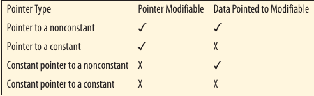

# Contants and Pointers

Using the **const** keywords with pointers is a rish and powerfull aspect of C. It provides different types of protections for different problem sets.

- [Pointers to a contants](101-pointers-to-a-constant.md)
- [Constant pointers to a nonconstants](102-constant-pointer-to-a-nonconstants.md)
- [Constant pointers to constants](103-constant-pointers-to-constants.md)
- [Pointer to constant pointer to constant](104-pointers-to-constant-pointer-to-constant.md)

The following table summarizes the first four type of pointers:

