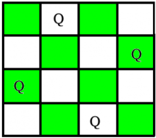

# Printing all solutions in N-Quens Problem

The N Queen is the probken of placing N chess queens on an NxN chessboard so that no two queens attack each other. For example the following is the solution for 4 Queen problem.



Each solution contains distinct board configurations of the N-queen's placement, where the solutions are a permutations of [1, 2, 3..n] in increasing order, here the number in the *ith* place denotes that the *ith*-column queen is placed in the row with that number. For example above solution can be written as [[2 4 1 3] [3 1 4 2]].

The idea is to place queens one by one in different columns, starting from the leftmost columns. When we place a queen in a column, we check for clashes with already placed queens. In the current column, if we find a row for which there is no clash, we mark this row and column as part of the column. If we do not find such a row due to clashes then we backtrack and return false.


```
1) Start in the leftmost column
2) If all queens are placed
    return true
3) Try all rows in the current column.  Do following
   for every tried row.
    a) If the queen can be placed safely in this row
       then mark this [row, column] as part of the 
       solution and recursively check if placing  
       queen here leads to a solution.
    b) If placing queen in [row, column] leads to a
       solution then return true.
    c) If placing queen doesn't lead to a solution 
       then unmark this [row, column] (Backtrack) 
       and go to step (a) to try other rows.
4) If all rows have been tried and nothing worked, 
   return false to trigger backtracking.
```