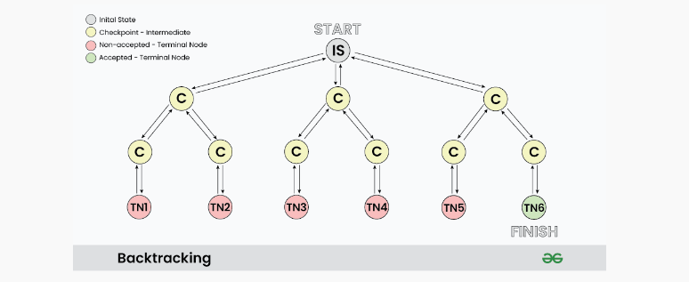

# Backtracking Algorithm


### What is Backtracking?

Backtracking is a problem-solving algorithm technique that involves finding a solution incrementally by trying **different options** and **undoing** them if they lead to a **dead end**.

It is commonly used in situations where you need to expore multiple possibilities to solve a problem, like searching for a path in a maze or solving puzzles like Soduku.

When a dead end is reached, the algorithm backtrends to the decision point and explores a different path until a solution is found or all possibilities have been exhausted.


**Backtracking can be defined as a general algorithmic technique that considers searching every possible combination in order to solve a computational problem.**

### Basic Terminologies

- **Candidate**: A candidate is a potential choice or element that can be added to the current solution.
- **Solution**: The solution is a valid and complete configuration that satisfies all problem constraints.
- **Partial Solution**: A partial solution is an intermidiate or incomplete configuration being constructed during the backtracking process.
- **Decision Space**: The decision space is the set of all possible candidates or choices at each decision point.
- **Decision Point**: A decision point is a specific step in the algorithm where a candidate is chosen and added to the partial solution.
- **Feasible Solution**: A feasible solution is a partial or complete solution that adheres to all constraints.
- **Dead End**: A dead end occurs when a partial solution cannot be extended without voilating constraints.
- **Backtrack**: Backtracking involes undoing previous decisions and returning to a prior decision point.
- **Search Space**: The search space includes all possible combinations of candidates and choices.
- **Optimal Solution**: In optimization problems, the optimal solution is the best possible solution.


### Types of Backtracking Problems

Problems associated with backtracking can be categorized into 3 categories:

- **Decision Problems**: Here, we search for a feasible solution.
- **Optimization Problems**: For this type, we search for the best solution
- **Enumeration Problems**: We find set of all possible feasible solutions for the problems of this type.


### How does Backtracking works?

Backtracking algorithm explores each and every possible path in order to find a valid solution, this exploration of path can be easily understood via given images:




As shown in the image, *"IS"* represents the **Initial State** where the recursion call starts to find a valid solution.

**C**: it represents different **Checkpoints** for recursive calls

**TN**: it represents the **Terminal Nodes** where no further recursive calls can be made, these nodes act as base case for recursion and we determine whether the current solution is valid or not at this state.

At each Checkpoint, our program makes some decisions and move to the other checkpoints until it reaches a terminal Node, after determining whether a solution is valid or not, the program starts to revert back to the checkpoints and try to explore other paths. For example in the above image **TN1..TN5** are the terminal node where the solution is not acceptable, while **TN6** is the start where we found a valid solution.

The back arrows in the images shows backtracking in actions, where we revert the changes made by some checkpoint.

### Pseudocode for Backtracking

The best way to implement backtracking is through recursion, and all backtracking code can be summarised as per the given Pseudocode:

```
void FIND_SOLUTIONS(parameters)
    if (valid solution)
        store the solution
        Return
    for (all choice)
        if (valid choice)
            APPLY (choice)
            FIND_SOLUTIONS (parameters)
            BACKTRACK (remove choice)
    Return
```


### Complexity Analysis of Backtracking

Since backtracking algorithm is purely brute force therefore in terms of complexity, it performs very poorly. Generally backtracking can be seen having below mentioned time complexities:

- Explonential (O(K^N))
- Factorial (O(N!))

These complexities are due to the fact that at each state we have multiple choices due to which the number of paths increases and sub-trees expends rapidly.


### Difference Backtracking and Recursion

#### Recursion

- Does not always need backtracking
- Solving problems by breaking them into smaller, similar subproblems and solving them recursively
- Controlled by function calls and call stack.
- Applications of Recursion: 
    - Tree and Graph Traversal
    - Towers of Hanoi
    - Divide and Conquer Algorithms
    - Merge Sort
    - Quick Sor
    - Binary Search

#### Backtracking

- Backtracking always uses recursion to solve problems
- Solving problems with multiple choices and exploring options systemically, backtracking when needed.
- Managed explicitly with loops and state
- Application of Backtracking: 
    - [N Queen problem](101-n-queens.md)
    - Rat in a Maze problem
    - Knight’s Tour Problem
    - Sudoku solver
    - Graph coloring problems


### Applications of Backtracking

- Creating smart bots to play Board Games such as Chess.
- Solving mazes and puzzles such as N-Queen Problem.
- Network Routing and Congestion Control
- Decryption
- Text Justification


### Problems