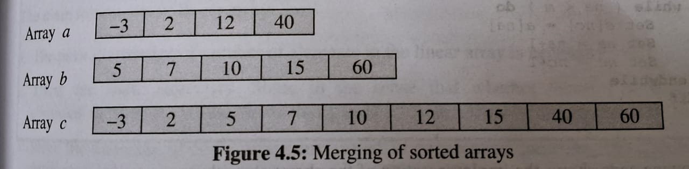

# Merge Operation

Merging is the process of combining the elements of two similar structures (linear arrays) into a single structure.

Suppose that two arrays are unsorted, we can combine them end to end i.e. we can first put elements of array *a* into third array *c*, and then the elements of the second array *b* are place after it in array *c*.

We will compare the elements of the given array, and based on this comparison; decide  which element should go first to the third array.



In case of sorted arrays, to start with, compare first element of array *a* (element -3) with the first element of array *b* (element 5), and put the smallest of these (-3) into array *c*. Since first element of array *a* is in array *c*, next we compare second element of array *a* (element 2) with the first element of array *b* (element 5), since 2 is the smallest, put it into *c*. Next compare third element of *a* (element 12) with first element of *b* (element 5), since 5 is the smallest, put it into *c*. next compare third element of *a* (element 12) and with second element of *b* (element 7), since 7 is the smallest, put it into *c*, and so on.

To achieve the above task, we use couters to keep track of the current element which is a candidate to go in *c*, and the position in *c* where it will be stored.


### Algorithm

```c
MergingSortedArrays(a, m, b, n, c, r)
```

Here *a* and *b* are stored (ascending) linear arrays of size *m* and *n*, respectively. This algorithm merges these arrays, by comparing their elements, into array c, which will be of size *m*+*n*. It uses variables *na* and *nb* to keep track of the respective elements of arrays *a* and *b*, and a variable *nc* to keep track of index in array *c* where the incoming element (either from array *c* and *b*) will be stored.

```
Begin
    Set na = 0
    Set nb = 0
    Set nc = 0
    while ((na < m) and (nb < n))
    do
        if ( a[na] < n[nb]) 
        then
            Set c[nc] == a[na]
            Set na = na + 1
        else
            Set c[nc] = b[nb]
            Set nb = nb + 1
        endif
        nc = nc + 1
    endwhile

    if (na == m) 
    then
        while (nb < n)
        do 
            Set c[nc] = b[nb]
            Set nb = nb + 1
            Set nc = nc + 1
        endwhile
    else
        while (na < m)
        do 
            Set c[nc] = a[na]
            Set na = na + 1
            Set nc = nc + 1
        endwhile
    endif
End
```


Codes:
    - [C](../103-codes/merging-sorted-array.c)