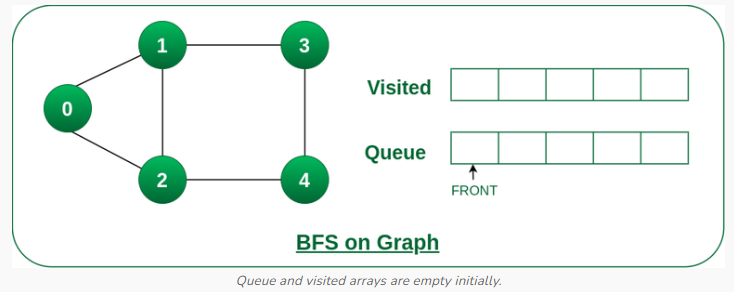
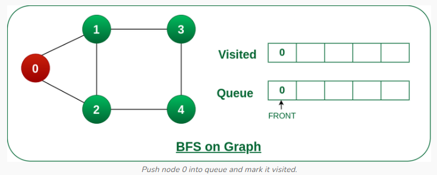
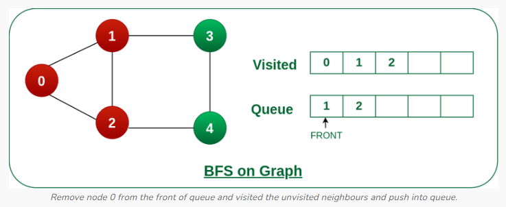
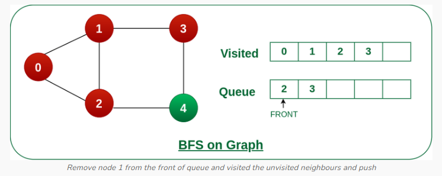
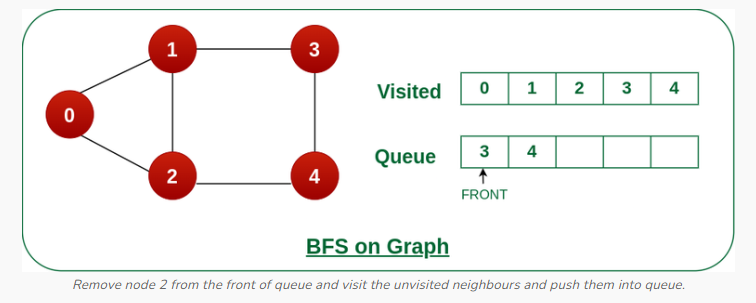
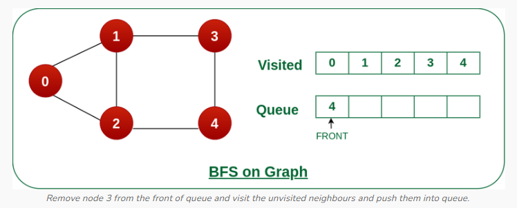
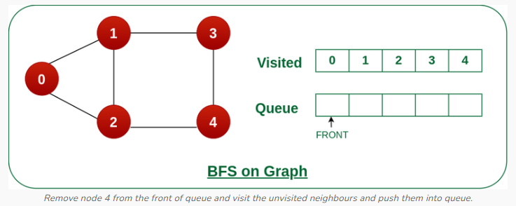

# Breadth First Search (BFS)

Breadth First Search (BFS) is a fundamental graph traversal algorithm. It involves visiting all the connected nodes of a graph in a level-by-level manner. 

BFS explores all the vertices in a graph at the current depth before moving on the vertices at the next depth level. It starts at a specified vetex and visits all its neighbors before moving on to the next level of neighbors. BFS is commonly used in algorithms for pathfinding, connected components, and shortest path problems in graphs.

### Relation between BFS in Graphs and BFS for Tree.

Unlike **trees**, **graphs** may contain cycles, so we may come to the same node again. To avoid processing a node more than once, we divide the vertices into two categories.

1. Visited
2. Not visited

A boolean visited array is used to mark the visited vertices. For simiplicity, it is assumed that all vertices are reachable from the starting index. BFS uses a **queue* data structure for traversal.


### Breadth First Search (BFS) for a Graph Algorithm

1. **Initialisation**: Enqueue the starting node into a queue and marked it as visited.
2. **Exploration**: While the queue is not empty.
    - Dequeue a node from the queue and visit it (e.g., print its value).
    - For each unvisited neighbor of the dequeued nodes:
        - Enqueue the neighbor into the queue.
        - Mark the neighbor as visited.
3. **Termination**: Repeat step 2 until the queue is emtpy


### Working of BFS Algorithm

Starting from the root, all the nodes at a particular level are visited first and then the nodes of the next level are traversed till the nodes are visited.

To do this a queue is used. All the adjacent unvisited nodes of the current level are pushed into the queue and the nodes of the current level are marked visited and popped from the queue.

Let us understand the working of the algorithm with the help of the following example:

##### Step 1: Initially queue and visited arrays are empty.



##### Step 2: Push node 0 into queue and mark it visited.



##### Step 3: Remove node 0 from the front of queue and visit the unvisited neighbors and push them into queue.



##### Step 4: Remove node 1 from the front of queue and visit the unvisited neightbors and push them into queue.



##### Step 5: Remove node 2 from the front of queue and visit the unvisited neighbors and push them into queue.




##### Step 6: Remove node 3 from the front of queue and visit the unvisited nrighbours and push them into queue.

As we can see that every neighbors of node 3 is visited, so move to the next node that are in the front of the queue.




##### Step 7: Remove node 4 from the front of queue and visit the unvsisted neighbors and push them into queue.

As we can see that every neighbors of node 4 are visited, so move to the next node that is in the front of the queue.



Now, Queue becomes empty, So terminate these process of iteration.


### Implementation

[Breadth First Serach using Adjacency Matrix](../../../implementation/dsa-py/ds/graph/bfs_using_adjacency_list.py)


```bash
Breadth First Traversal starting from vertex 0: 0 1 2 3 4
```

**Time Complexity**: O(V+E), where V is the number of nodes and E is the number of edges.

**Auxiliary Space**: O(V)


### Complexity Analysis of Breadth-First Search (BFS) Algorithm:

#### Time Complexity of BFS Algorithm: O(V+E)

BFS explores all the vertices and edges in the graph. In the wrost case, it visits every vertex and edge once. Therefore, the time complexity of BFS is O(V+E), where V and E are the number of vertices and edges in the given graph.

#### Space Complexity of BFS Algorithm: O(V)

BFS uses a queue to keep track of the vertices that need to be visited. In the wrost case, the queue can contain all the vertices in the graph. Therefore, the space complexity of BFS is O(V), where V and E are the number of vertices and edges in the given graph.


### Applications of BFS in Graphs

BFS has various aplications in graph theory and computer science, including:

- **Shortest Path Finding**: BFS can be used to find the shortest path between two nodes in an unweighted graph. By keeping track of the parent of each node during traversal, the shortest path can be reconstructed.
- **Cycle Detection**: BFS can be used to detect cycles in a graph. If a node is visited twice during the traversal, it indicates the presence of a cycle.
- **Connected Components**: BFS can be used to identify connected components in a graph. Each component is a set of nodes that can be reached from each other.
- **Topological Sorting**: BFS can be used to perform topological sorting on a directed acyclic graph (DAG). Topological sorting arranges the nodes in a linear order such that for any edge (u, v), u appears before v in the order.
- **Level Order Traversal of Binary Trees**: BFS can be used to perform a level order traversal of a binary tree. This traversal visits all nodes at the same level before moving to the next level.
- **Network Routing**: BFS can be used to find the shortest path between two nodes in a network, making it usefull for routing data packets in network protocols.